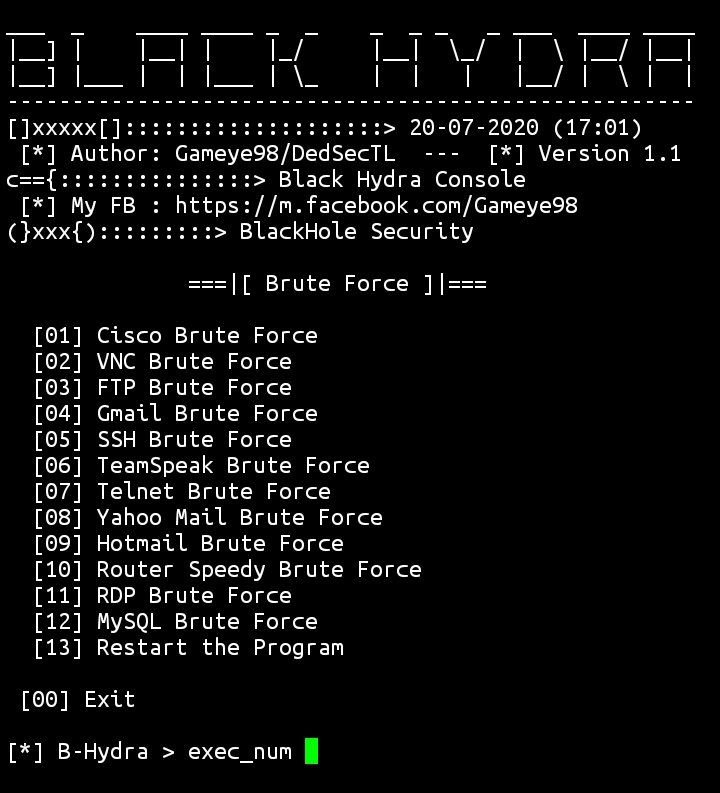

  

# Black Hydra
This program is just a small program to shorten brute force sessions on hydra :)
But to be more satisfying results of the brute force. You better interact directly with hydra,
without having to use this black hydra console first: ').
If you find any errors in running our program. Can chat via facebook :).
Hydra is needed for the process of this program :).

## Screenshot

### Contact Me
[My FB Account](https://www.facebook.com/Gameye98)  
[My Telegram Account](https://t.me/dtlily)  
[BHS Facebook Page](https://www.facebook.com/2018336478223944/)  
[BHS Telegram Channel](https://t.me/bhs3c)  
[BHS Telegram Group](https://t.me/BHSec)